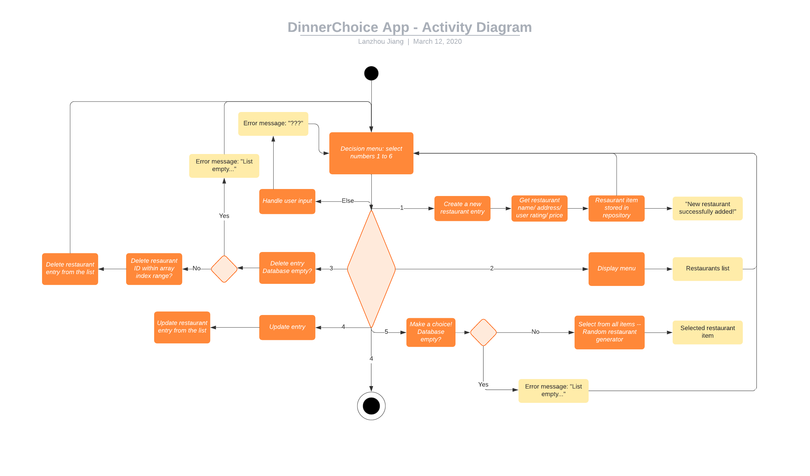

# DinnerChoice


### Source control repository

* https://github.com/Lanzhou-J/DinnerChoice

### Statement of purpose and scope

This gem (terminal app) is designed to record information (e.g. name(brand), address, average price) and user-reviews of different restaurants. Users are able to add restaurants entry, display restaurants in a list format, delete any restaurant and update their information. Users can rate the restaurant on a scale of 1-5, 1 being the lowest(poor), 5 being the highest(great). Moreover, the app can help users make quick lunch/dinner decisions (or help users reach a consensus easily). Users can "roll a dice" to get a random selection from the up-to-date restaurants list.

With the progression of human civillization in this internet era, modern people are facing more and more choices (especially food choices !). Sometimes I even felt like I was drowning in infinite choices everyday. The original intention of designing this app is to help the people of modern fast-paced life to save time wasted on “making decisions on what to eat” and devote limited time and energy to more valuable things, such as reading, studying, writing ... (Or practice programming!)

Have you ever spent too much time trying to make a decision as where to go for lunch or dinner? Have you ever felt that making decisions inspires intense anxiety and relied on others to make decisions for you? Have you ever argued with your partner over which restaurant to choose for a romantic evening? No more "decidophobia", no more time-wasting...**The DinnerChoice app is designed just for you!**

With this app, you will be able to easily record, rate and compare different restaurants. When time is limited, or you are with lots of friends with different opinions and it is just too hard to decide your next dine out destination, just take a leap of faith and let the app make the decision for you.

### Features:
* Ascii art text banner in terminal header.


* Create your resaurants collections. <br>
Users are able to create a new restaurant entry to record information related to the restaurant, including name(brand), location, price and their rating of the restaurant. After adding a new entry, the added restaurant will be appended to the bottom of the list with a new automatically generated ID.

* View name, address and price of restaurants -- information that you need to choose a restaurant for dine out. <br>
Users are able to select display function to view all restaurant entries in the current list. After editing (add, delete or update) the list displayed will change accordingly.

* Rate and review restaurants that you have been visited before.

* Update restaurants' information easily.<br>
  Users are able to select which restaurant to edit and which attribute they want to change (name/ address/ rating and average price). Then they can input the new content of the attribute to overwrite the previous information. 

* Delete any restaurant from you list. <br>
Users can delete any entry from the existing restaurants list. The ID of the restaurants in the list will automatically changed according to the latest order. However if there is nothing in the list the app will output an error message to remind the user to select function from main menu again.

* Make quick decisions.

### Outline of user interaction and experience

 * The user will find out how to interact with the terminal app by reading the contents of "<font color="#dddd00">MAIN MENU</font>". Then users can select from the main menu (input number, select from 1 to 6). By doing so, they can choose to use each feature. After executing a function, the main menu list will display again and ask the user to select again. User can leave the app by inputing '6' (or '6.', 'exit').<br>

 ```
MAIN MENU
1. Create a new restaurant entry
2. Display or search restaurants by key words
3. Delete an existing entry
4. Update info of an existing entry
5. Make a choice! (random generator)
6. Exit (or input "exit")

Please select from the MAIN MENU (select numbers 1 to 6):
> 6
See you next time!
```

* Error handling: When selecting functions from <font color="#dddd00">MAIN MENU</font>, if users input wrong selection (e.g. '7', '9' or other numbers/letters), the app will output an error message an ask the user to select from the menu again.<br>
```
? ? ? ? ? ? ? ?
Sorry I don't understand...
Please select from 1 to 6, or input 'exit'.
```
* Error handling: Similarly, if users input wrong ID number to delete or update a restaurant entry, the app will output an error message and give users advice:<br>
```
? ? ? ? ? ? ? ?
Sorry I don't understand...
Please select ID from the existing restaurants list.
```

* Error handling: If users select delete or update function but the restaurants list is empty, the app will tell the user that the list is empty:<br>
```
List is empty, nothing to delete.
```

##### 1. Create new entry: 
* After selecting "1" (or "1."). The user will be aksed to input the name (brand), address, rating and money usually spent(unit: AUD) of the restaurant (e.g. name:"Pappa Rich", address:"Southern cross station", rating:"3.5", average price:"9")
```
What's the name of the restaurant you'd like to add?
> 
What's the address of the restaurant you'd like to add?
> 
How do you like this restaurant? please rate on a scale of 1-5, 1 being the lowest(poor), 5 being the highest(great).
> 
How much do you usually spend in this restaurant?
> 
```
* After adding a new restaurant, the app will calculate if the list count has increased by 1, if yes, then output a message telling users that the new entry has been successfully added.<br>
```
> > > > > > > > > > > > > > > > > > 
New restaurant is successfully added!
```
##### 2. Display restaurants
* If nothing is added to the default restaurants list, the default restaurants list will be displayed as below:<bt>

```
-------------------------
ID: 1
Name: Pappa Rich
Address: Southern cross station, L1-CS-03
Rating: 3.5
Average Price: $9
-------------------------
ID: 2
Name: Hungry Jack's
Address: Spencer Street
Rating: 2.5
Average Price: $9.5
-------------------------
ID: 3
Name: Grill'd
Address: Southern cross station
Rating: 4
Average Price: $17
-------------------------
```

##### 3. Delete an existing entry
* The app will ask the user to select which restaurant to delete from the list (by selecting their ID).<br>
```
Which restaurant do you want to delete from the list? Please input the ID number:
> 
```
* After deleting an existing entry, the app will calculate if the list count has decreased by 1, if yes, then output a message telling users that the entry has been successfully deleted:<bt>
```
> > > > > > > > > > > > > > > > > > 
The restaurant is successfully deleted!
```
##### 4. Update info
* The app will interact with users by asking which restaurant do they want to edit:<br>
```
Which restaurant do you want to edit? Please input the ID number:
> 2
Which feature do you want to edit? Please select from name/address/rating/price:
> rating
Please input new content:
> 3
> > > > > > > > > > > > > > > > > > 
The restaurant is successfully edited!
```

##### 5. Make a choice!
* Once "Make a choice" function is selected, the app will randomly select a restaurant from the current restaurants list. The restaurant will then be displayed with all the information.

### Diagram of the control flow



### Implementation plan

Please refer to my [Trello board][board].

[board]: https://trello.com/b/sG3Qx1Wr/dinnerchoiceterminal-app "Trello board"


## Installation

#### 1. Install ruby:

* Install Homebrew (for MacOS users): <br>
Homebrew is a package manager for Mac. It will allow us to easily install ruby. Run the following command in terminal:
```
/usr/bin/ruby -e "$(curl -fsSL https://raw.githubusercontent.com/Homebrew/install/master/install)"
```

* You need to install ruby to run this app. To verify you have ruby installed on your machine run:
```
ruby -v
```
* If you get no result from this command ruby isn't installed. There are many ways to install ruby but i recommend using rbenv.

* rbenv is a great Ruby version manager. We will use it to install and manage different versions of ```Ruby```.

* Install ```rbenv``` using Homebrew:
```
brew install rbenv
```
* Set up ```rbenv``` in shell by running command below:
```
rbenv init
```
* Close terminal and open a new terminal window
* Verify that ```rbenv``` is setup properly by running the ```rbenv-doctor``` script
```
curl -fsSL https://github.com/rbenv/rbenv-installer/raw/master/bin/rbenv-doctor | bash
```
* Ruby installation, run the following code:
```
rbenv install 2.7.0
```
* This will install a version of Ruby on your computer.

* In order to use ```2.7.0``` globally on your computer, you need to run the following command:
```
rbenv global 2.7.0
```
* Run the following command to check if ruby is installed properly:
```
ruby -v
```
If you see this message (or similar message containing ```2.7.0```) in terminal, you have installed Ruby successfully.
```
ruby 2.7.0p0 (2019-12-25 revision 647ee6f091) [x86_64-darwin18]
```

REQUIRED RUBY VERSION: ```>= 2.3.0```
#### 2. Install Gem

* You can find the gem ```DinnerChoice 0.1.1``` on rubygems.org --  see link: [DinnerChoice](https://rubygems.org/gems/DinnerChoice)


* Add this line to your application's Gemfile:

```ruby
gem 'DinnerChoice'
```

* And then execute:
```
$ bundle install
```
* Or install it yourself as:
```
$ gem install DinnerChoice
```

#### 3. Listing installed Gems
* You can use ```gem list``` command to view all the gems that have been installed in the computer.
```
$ gem list
```
* All the gems that you have installed before should appear in terminal window.

#### 4. Using Gem

* In terminal window, enter into irb by inputing "irb" and press Enter, then require gem:
```
$ irb
irb(main):001:0> require "DinnerChoice"
```


Then you should be able to use the DinnerChoice app!
#### 5. Uninstall Gem
* The uninstall command removes the gems you have installed.
```
$ gem uninstall DinnerChoice
Successfully uninstalled DinnerChoice 0.1.1
```
#### 5. For Linux and windows users
* For Linux users, please follow [this guide](https://www.digitalocean.com/community/tutorials/how-to-install-ruby-on-rails-with-rbenv-on-ubuntu-18-04) to install ```rbenv```. Other steps are similar to the steps mentioned above.

* For windows users, you need to use a virtual machine to run [Ubuntu](https://ubuntu.com/), you can use some software called [VMware Workstation](https://www.vmware.com/products/workstation-pro.html). This will allow you to run the Ubuntu OS virtually. Once succeeded, follow the previous guide to install rbenv and Gem.

## Usage
### Help documentation
Please also see the "Outline of user interaction and experience" section.

In order to use it users need to select the options displayed in <font color="#dddd00">MAIN MENU</font> (select number from 1 to 6, or input "exit" to leave the app).

1. Create new restaurant entry:<br> 
In order to create a new restaurant, users need to input "1", and then add name, address, rating and average meal price. If the entry is successfully added, a message will tell the user that a new entry is successfully added.

2. Display restaurants list: <br>
If users select "2", the default restaurants list will appear on screen which allow the users to review and compare the restaurants.

3. Delete an existing restaurant entry:<br>
In order to delete an entry, users need to input the ID of the restaurant that needs to be deleted. If nothing is in the list, the app will tell the user that nothing is in the list.

4. Update an existing restaurant entry:<br>
When selected the "Update info" selection (number 4) in <font color="#dddd00">MAIN MENU</font>, the app will ask the users to input the ID of the restaurant that needs to be updated and input the specific attribute, new content of the attribute in order to update information.

5. Make a choice from the existing restaurants list:<br>
Once "Make a choice" function is selected, the app will display a randomly selected item from the current restaurants list.

## Tests
I used manual testing to test my app. You can find a spreadsheet in Google file:
[Test case spreadsheet](https://docs.google.com/spreadsheets/d/16QYt6_DTL253NrGNKjdTA68KubFQsKqMnZYYm90FH2g/edit?usp=sharing)

## Development

After checking out the repo, run `bin/setup` to install dependencies. Then, run `rake spec` to run the tests. You can also run `bin/console` for an interactive prompt that will allow you to experiment.

To install this gem onto your local machine, run `bundle exec rake install`. To release a new version, update the version number in `version.rb`, and then run `bundle exec rake release`, which will create a git tag for the version, push git commits and tags, and push the `.gem` file to [rubygems.org](https://rubygems.org).

## Contributing

Bug reports and pull requests are welcome on GitHub at https://github.com/Lanzhou-J/DinnerChoice. This project is intended to be a safe, welcoming space for collaboration, and contributors are expected to adhere to the [code of conduct](https://github.com/[USERNAME]/DinnerChoice/blob/master/CODE_OF_CONDUCT.md).

## Code of Conduct

Everyone interacting in the DinnerChoice project's codebases, issue trackers, chat rooms and mailing lists is expected to follow the [code of conduct](https://github.com/[USERNAME]/DinnerChoice/blob/master/CODE_OF_CONDUCT.md).

## Reference

* Vector Illustration https://undraw.co/illustrations
* [Restaurants near Southern Cross station](https://www.zomato.com/melbourne/fast-food?group_id=31153)
* [An introduction of decidophobia](https://www.bustle.com/articles/157828-5-signs-you-might-have-decidophobia-or-fear-of-making-decisions)
* [How To Install Ruby on Rails with rbenv on Ubuntu](https://www.digitalocean.com/community/tutorials/how-to-install-ruby-on-rails-with-rbenv-on-ubuntu-18-04)
* [Ubuntu](https://ubuntu.com/)
* [vmware](https://www.vmware.com/products/workstation-pro.html)